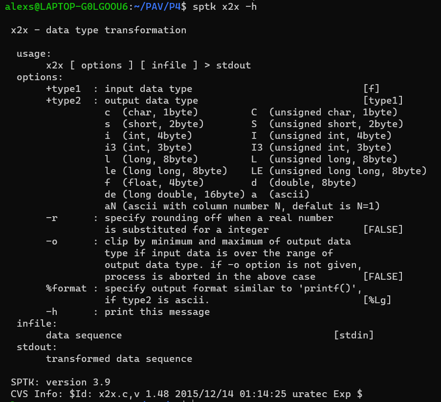

PAV - P4: reconocimiento y verificación del locutor
===================================================

Obtenga su copia del repositorio de la práctica accediendo a [Práctica 4](https://github.com/albino-pav/P4)
y pulsando sobre el botón `Fork` situado en la esquina superior derecha. A continuación, siga las
instrucciones de la [Práctica 2](https://github.com/albino-pav/P2) para crear una rama con el apellido de
los integrantes del grupo de prácticas, dar de alta al resto de integrantes como colaboradores del proyecto
y crear la copias locales del repositorio.

También debe descomprimir, en el directorio `PAV/P4`, el fichero [db_8mu.tgz](https://atenea.upc.edu/mod/resource/view.php?id=3654387?forcedownload=1)
con la base de datos oral que se utilizará en la parte experimental de la práctica.

Como entrega deberá realizar un *pull request* con el contenido de su copia del repositorio. Recuerde
que los ficheros entregados deberán estar en condiciones de ser ejecutados con sólo ejecutar:

~~~~~~~~~~~~~~~~~~~~~~~~~~~~~~~~~~~~~~~~~~~~~~~~~~~~~.sh
  make release
  run_spkid mfcc train test classerr verify verifyerr
~~~~~~~~~~~~~~~~~~~~~~~~~~~~~~~~~~~~~~~~~~~~~~~~~~~~~

Recuerde que, además de los trabajos indicados en esta parte básica, también deberá realizar un proyecto
de ampliación, del cual deberá subir una memoria explicativa a Atenea y los ficheros correspondientes al
repositorio de la práctica.

A modo de memoria de la parte básica, complete, en este mismo documento y usando el formato *markdown*, los
ejercicios indicados.

## Ejercicios.

### SPTK, Sox y los scripts de extracción de características.

- Analice el script `wav2lp.sh` y explique la misión de los distintos comandos involucrados en el *pipeline*
  principal (`sox`, `$X2X`, `$FRAME`, `$WINDOW` y `$LPC`). Explique el significado de cada una de las 
  opciones empleadas y de sus valores.
  
  `sox:` Permite la conversión de una señal de entrada sin cabecera a una del formato adecuado. Hay dos tipos de formatos de audio con los que SoX puede trabajar. El    "autodescriptivo", incluyen un encabezado que describen completamente  las características de los datos de audio que siguen. El segundo tipo es "sin encabezado", en los  que se deben describir las características de los datos de audio utilizando la línea de comando Sox.
  
  
  
  
  `x2x:` es una de las funciones de SPTK que permite la conversión entre distintos formatos de datos, segun lo que especificames en el comando, entre las opciones se encuentra convertir a un formato de caracteres o por ejemplo unsigned long long de 8 bytes. Se debe especificar si se quiere redondeo en el caso que un número real  sea substituido por un entero. En la imagen se pueden observar las varias posibilidades de conversión.
  
  
  
  `Frame:` es una de las funciones de SPTK que permite dividir la señal de entrada en tramas de -l muestras (en nuestro caso 240 muestras), y con un desplazamiento entre tramas indicado por la opción -p (en nuestro caso de 80 muetras).
  
  
  
  `Window:` es una función de SPTK que permite el enventanado de la señal, indicando el tamaño del frame de entrada -l (en nuestro caso 240) i el tamaño del frame de salida con -L (en este caso el mismo que el frame de entrada).
  
  
  
  `LPC:` función de SPTK que nos permite obtener los coeficientes LPC usando el método de Levinson-Durbin. Debemos indicarle el tamaño del frame de entrada con -l (como hemos indicado anteriormente 240) y el orden del LPC con -m (en este caso, se lo pasamos como parámetro definido por el usuario).
  
  
  
  Finalmente explicamos el funcionamiento del pipeline principal:
  ```bash
  sox $inputfile -t raw -e signed -b 16 - | $X2X +sf | $FRAME -l 240 -p 80 | $WINDOW -l 240 -L 240 |
	$LPC -l 240 -m $lpc_order > $base.lp || exit 1
  ```
  
  Se utiliza sox para convertir un archivo de entrada inputfile (que se encuentra en este caso, en formato .wav) a formato raw sin encabezados utilizando la opción ``-t raw``. La señal también se codifica con signo ``-e signed`` y cada muestra se cuantifica con 16 bits ``-b 16``.
  
  A continuación, se utiliza ``x2x`` para convertir los datos de tipo short con signo a float con la opción ``+sf``. La señal se divide en tramas utilizando el comando ``frame`` con un tamaño de trama de 240 muestras/30 ms (``-l 240``) y un desplazamiento entre tramas de 80 muestras (``-p 80``). La señal se enventana a continuación con el comando ``window``, indicando el tamaño de trama de entrada (``-l 240``) y el de salida (``-L 240``).
  
  Finalmente, se obtienen los coeficientes del LPC utilizando el comando ``lpc``, indicando el tamaño de trama de entrada (``-l 240``) y el orden del LPC (``-m``), que es especificado por el usuario. El resultado se guarda en un archivo temporal ``$base.lp``.

- Explique el procedimiento seguido para obtener un fichero de formato *fmatrix* a partir de los ficheros de
  salida de SPTK (líneas 49 a 51 del script `wav2lp.sh`).
  
  ~~~~~~~~~~~~~~~~~~~~~~~~~~~~~~~~~~~~~~~~~~~~~~~~~~~~~.sh
  # Our array files need a header with the number of cols and rows:
  ncol=$((lpc_order+1)) # lpc p =>  (gain a1 a2 ... ap) 
  nrow=`$X2X +fa < $base.lp | wc -l | perl -ne 'print $_/'$ncol', "\n";'`
  ~~~~~~~~~~~~~~~~~~~~~~~~~~~~~~~~~~~~~~~~~~~~~~~~~~~~~
  
  Para obtener el número de columnas, se sabe que corresponde al número de coeficientes LPC más 1, para obtener el número de filas, se convierte la señal parametrizada a texto con el comando X2X, luego se utiliza ``wc`` con la opción ``-l`` para contar el número de líneas en el resultado. Debido a que cada fila siempre tiene ``ncol`` columnas, se puede utilizar el comando perl para dividir el número de valores en el archivo por ``ncol`` y obtener el número de filas. La operación se realiza mediante el uso de la pipeline y la instrucción ``perl -ne 'print $_/'$ncol', "\n";'``.

  * ¿Por qué es más conveniente el formato *fmatrix* que el SPTK?
  
  El formato fmatrix es un formato de texto simple y fácil de leer y procesar, lo que hace que sea muy eficiente para almacenar y manipular grandes cantidades de datos de matriz. En comparación, el formato SPTK es un formato binario que puede ser más difícil de leer y procesar, especialmente para grandes cantidades de datos.
  La matriz resultante es muy útil para identificar correctamente los coeficientes por trama. En el archivo fmatrix, se especifican el número de filas y columnas de la matriz, seguidos de los datos almacenados en forma de lista de valores separados por espacios. Cada fila de la matriz corresponde a una trama de señal y cada columna a cada uno de los coeficientes con los que se parametriza la trama.
  Los programas ``fmatrix_show`` y ``fmatrix_cut`` se pueden utilizar para mostrar y elegir los coeficientes 2 y 3 necesarios para el análisis, respectivamente. En resumen, el formato fmatrix permite trabajar de forma más eficiente con los datos al facilitar la identificación y manipulación de los coeficientes por trama.
  

- Escriba el *pipeline* principal usado para calcular los coeficientes cepstrales de predicción lineal
  (LPCC) en su fichero <code>scripts/wav2lpcc.sh</code>:
  
  ~~~~~~~~~~~~~~~~~~~~~~~~~~~~~~~~~~~~~~~~~~~~~~~~~~~~~.sh
  sox $inputfile -t raw -e signed -b 16 - | $X2X +sf | $FRAME -l 240 -p 80 | $WINDOW -l 240 -L 240 |
	$LPC -l 240 -m $lpc_order | $LPC2C -m $lpc_order -M $cepstrum_order > $base.lpcc || exit 1
  ~~~~~~~~~~~~~~~~~~~~~~~~~~~~~~~~~~~~~~~~~~~~~~~~~~~~~
Hemos usado wav2lp.sh para crear el script wav2lpcc.sh y éste último lo hemos incluido en el script meson-build para compilar el programa y tenerlo dentro. La pipeline principal de la parametrización LPCC tiene la misma forma que anteriormente, con la diferencia que ahora tenemos en cuenta que para localizar los coeficientes cepstrales, antes debemos obtener los coeficientes LPC. Por eso, sacamos los coeficientes LCP (comando *lcp*) antes de pasar los datos de parametrización cepstral al archivo .lpcc.
Con el comando lpcc obtenemos los coeficientes LPCC.

- Escriba el *pipeline* principal usado para calcular los coeficientes cepstrales en escala Mel (MFCC) en su
  fichero <code>scripts/wav2mfcc.sh</code>:
  
   ~~~~~~~~~~~~~~~~~~~~~~~~~~~~~~~~~~~~~~~~~~~~~~~~~~~~~.sh
   sox $inputfile -t raw -e signed -b 16 - | $X2X +sf | $FRAME -l 240 -p 80 | $WINDOW -l 240 -L 240 |
	$MFCC -l 240 -s 8 -w 0 -m $mfcc_order -n $nfilter > $base.mfcc || exit 1
   ~~~~~~~~~~~~~~~~~~~~~~~~~~~~~~~~~~~~~~~~~~~~~~~~~~~~~
Igual que en el caso anterior, aplicamos los mismos pasos pero ahora en vez de LPCC buscamos los coeficientes cepstrales en escala Mel (MFCC) utilizando el comando mfcc. En el comando incluimos el número de coeficientes y el banco de filtros que usamos.
### Extracción de características.

- Inserte una imagen mostrando la dependencia entre los coeficientes 2 y 3 de las tres parametrizaciones
  para todas las señales de un locutor.
  
  + Indique **todas** las órdenes necesarias para obtener las gráficas a partir de las señales 
    parametrizadas.
    
    Primero debemos ejecutar ``run_spkid parametrización`` para obtener las señales parametrizadas  con ``LP``, ``LPCC`` y ``MFCC``.
    A partir de este punto ya obtenemos los ficheros de las señales parametrizadas, tenemos que tener en cuenta que la primera columna es un contador de tramas, la segunda columna corresponde a la ganancia, asi que debemos escoger la quarta y quinta columna para los coeficientes 2 y 3. Utilizando el siguiente comando obtenemos un fichero txt de los coeficientes 2 y 3 para cada parametrización.
    
    ~~~~~~~~~~~~~~~~~~~~~~~~~~~~~~~~~~~~~~~~~~~~~~~~~~~~~.sh
    fmatrix_show work/lp/BLOCK00/SES000/*.lp | egrep '^\[' | cut -f4,5 > lp_2_3.txt
    fmatrix_show work/lpcc/BLOCK00/SES000/*.lpcc | egrep '^\[' | cut -f4,5 > lpcc_2_3.txt
    fmatrix_show work/mfcc/BLOCK00/SES000/*.mfcc | egrep '^\[' | cut -f4,5 > mfcc_2_3.txt
    ~~~~~~~~~~~~~~~~~~~~~~~~~~~~~~~~~~~~~~~~~~~~~~~~~~~~~
    
    Desde la carpeta ``P4`` podemos llamar la función ``python3 scripts/plot_coef.py``, la cual crea la gráfica para las varias parametrizaciones y la guarda en formato imagen.
    
  + ¿Cuál de ellas le parece que contiene más información?

- Usando el programa <code>pearson</code>, obtenga los coeficientes de correlación normalizada entre los
  parámetros 2 y 3 para un locutor, y rellene la tabla siguiente con los valores obtenidos.
  
  Usando <code>pearson</code> obtenemos los archivos .txt donde están incluidos los coeficientes de correlación. Los comandos son los siguientes:
  
  
   ~~~~~~~~~~~~~~~~~~~~~~~~~~~~~~~~~~~~~~~~~~~~~~~~~~~~~.sh
   pearson -N work/lp/BLOCK01/SES010/*.lp >lp_pearson.txt
   ~~~~~~~~~~~~~~~~~~~~~~~~~~~~~~~~~~~~~~~~~~~~~~~~~~~~~
   
   
  
   ~~~~~~~~~~~~~~~~~~~~~~~~~~~~~~~~~~~~~~~~~~~~~~~~~~~~~.sh
   pearson -N work/lpcc/BLOCK01/SES010/*.lpcc >lpcc_pearson.txt
   ~~~~~~~~~~~~~~~~~~~~~~~~~~~~~~~~~~~~~~~~~~~~~~~~~~~~~
   
   
   
   ~~~~~~~~~~~~~~~~~~~~~~~~~~~~~~~~~~~~~~~~~~~~~~~~~~~~~.sh
   pearson -N work/mfcc/BLOCK01/SES010/*.mfcc >mfcc_pearson.txt
   ~~~~~~~~~~~~~~~~~~~~~~~~~~~~~~~~~~~~~~~~~~~~~~~~~~~~~
   
   
   
   A partir de las gráficas anteriores obtenemos la rho[2][3] para cada uno de los tipos de coeficientes (lp, lpcc y mfcc):
   

  |                        |    LP   |  LPCC  |  MFCC   |
  |------------------------|:-------:|:------:|:-------:|
  | &rho;<sub>x</sub>[2,3] |-0.666745|0.303116|0.0588095|
  
  + Compare los resultados de <code>pearson</code> con los obtenidos gráficamente.
  
- Según la teoría, ¿qué parámetros considera adecuados para el cálculo de los coeficientes LPCC y MFCC?

Según la teoría, para el caso de LPCC, el valor óptimos para trabajar con él es de 13 coeficientes.
Para los MFCC, en cambio, es recomendable el uso de entre 24 y 40 filtros del banco Mel y también unos 13 coeficientes Mel-cepstrales. En el caso de MFCC usar más coeficientes Mel-cepstrales (a partir de 20 coeficientes) podría dar lugar a errores.

### Entrenamiento y visualización de los GMM.

Complete el código necesario para entrenar modelos GMM.

- Inserte una gráfica que muestre la función de densidad de probabilidad modelada por el GMM de un locutor
  para sus dos primeros coeficientes de MFCC.

- Inserte una gráfica que permita comparar los modelos y poblaciones de dos locutores distintos (la gŕafica
  de la página 20 del enunciado puede servirle de referencia del resultado deseado). Analice la capacidad
  del modelado GMM para diferenciar las señales de uno y otro.

### Reconocimiento del locutor.

Complete el código necesario para realizar reconociminto del locutor y optimice sus parámetros.

- Inserte una tabla con la tasa de error obtenida en el reconocimiento de los locutores de la base de datos
  SPEECON usando su mejor sistema de reconocimiento para los parámetros LP, LPCC y MFCC.

### Verificación del locutor.

Complete el código necesario para realizar verificación del locutor y optimice sus parámetros.

- Inserte una tabla con el *score* obtenido con su mejor sistema de verificación del locutor en la tarea
  de verificación de SPEECON. La tabla debe incluir el umbral óptimo, el número de falsas alarmas y de
  pérdidas, y el score obtenido usando la parametrización que mejor resultado le hubiera dado en la tarea
  de reconocimiento.
 
### Test final

- Adjunte, en el repositorio de la práctica, los ficheros `class_test.log` y `verif_test.log` 
  correspondientes a la evaluación *ciega* final.

### Trabajo de ampliación.

- Recuerde enviar a Atenea un fichero en formato zip o tgz con la memoria (en formato PDF) con el trabajo 
  realizado como ampliación, así como los ficheros `class_ampl.log` y/o `verif_ampl.log`, obtenidos como 
  resultado del mismo.
